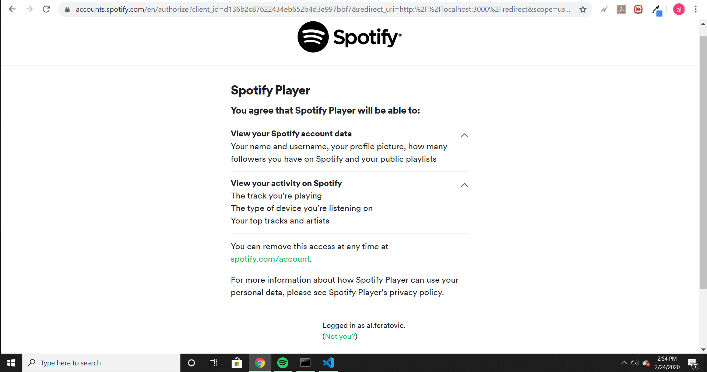
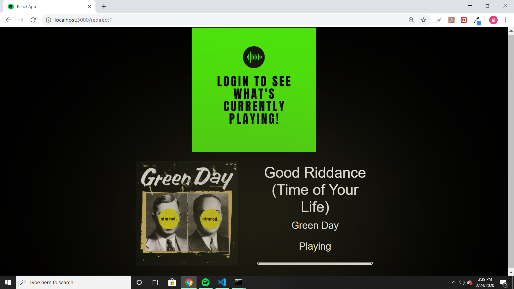

<h1> Welcome to my Spotify Player App</h1>

<h2>A Desktop App that utilizes the Spotify Developer API to create a music player which shows the current song information that the user is listening to, including Track Title and artist.</h2>

<h2>Key features of this application include User Authorization, API integration, and a simple Spotify-like interface; look closely at the Browser tab's icon!</h2>

<h2>Here is an example of the Spotify Account Services agreement that the user has to agree to in order to authorize the app to reflect the current track that's playing:</h2>

<h2>Here is an example image of the actual DOM once the user is signed in:</h2>

